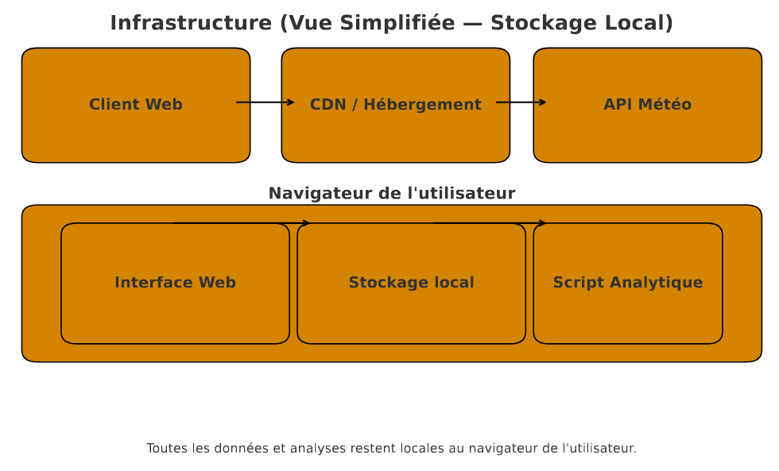
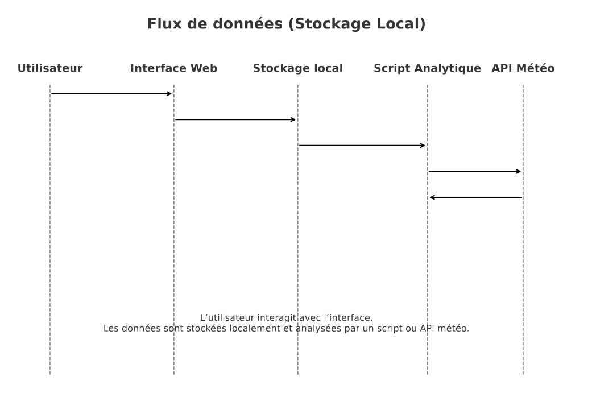

# Moodflow

Moodflow est une application Vue 3 + Vite qui permet de consigner ses humeurs, de visualiser des tendances au fil du temps et d'explorer des analyses assistées par la météo.

## Site hebergé sur Vercel 

- [MoodFlow+](https://moodflowforynov.vercel.app/)
chaque push sur master fais une mise en prod automatique 


### Infra




### Flux de données



### Modèle de données simplifié 

Les données sont stockées dans le navigateur dans le localstorage avec un format Clé/Valeur.
Aucune base distante utilisée


## Techno utilisé 
- Pour le front le framework Vue.js est utilisé pour des raisons de simplicité et que l'application est seulement une seule page
- Pour les graph la librairie chart.js a été utilisé (doc simple)
- ESLint + Prettier pour le formattage et la qualité du code

## rôles des membres 


- Dany (Front)
- Leo (Front)
- Slim (Archi + graph)
- Matthieu (Graph)
- Alec (Graph)
- Théo (Front + api météo + prédiction )


## Bonus implémenté 
- Api météo
- Thème sombre/clair automatique 
- Calendrier mensuelle 
- Prédiction 

## Choix UX
- Un UI/UX simple d'utilisation et facile a comprendre avec des hover

## Aperçu rapide

- Suivi quotidien de l'humeur avec notes personnelles et palette d'émojis.
- Vue calendrier mensuelle et navigation hebdomadaire rapide.
- Section analytics avec graphiques Chart.js (tendances, répartition, prédictions météo).
- Thèmes clair/sombre synchronisés avec le système.

## Structure du projet

```
src/
  assets/           # Styles globaux et variables de thème
  components/       # Composants Vue réutilisables (UI, modales, analytics)
  controllers/      # Logique métier orchestrant l'état réactif
  models/           # Pure logic: calculs, helpers, accès au stockage
  main.js           # Point d'entrée Vue
```

Cette organisation sépare la logique d'orchestration (`controllers`) de la logique pure (`models`) et facilite les tests ciblés.

## Installation & commandes

```sh
npm install          # Installe les dépendances
npm run dev          # Démarre le serveur de dev Vite
npm run build        # Génère le build de production
npm run preview      # Prévisualise le build
npm run lint         # Analyse ESLint (Vue 3 + Prettier)
npm run lint:fix     # Corrige automatiquement les problèmes simples
npm run format       # Vérifie la mise en forme Prettier
npm run format:fix   # Ré-écrit les fichiers avec Prettier
```

## Qualité & bonnes pratiques

- ESLint + `eslint-plugin-vue` sécurisent la cohérence du code Vue.
- Prettier garantit la mise en forme (indentation, guillemets, largeur de ligne).
- Des helpers purs dans `models/` permettent des tests unitaires sans monter Vue.
- Les composants s'appuient sur l'injection d'un contrôleur (`provide/inject`) pour éviter le prop drilling.

## Ressources utiles

- [Documentation Vue 3](https://vuejs.org/guide/introduction.html)
- [Vite](https://vite.dev/config/)
- [Chart.js](https://www.chartjs.org/docs/latest/)


